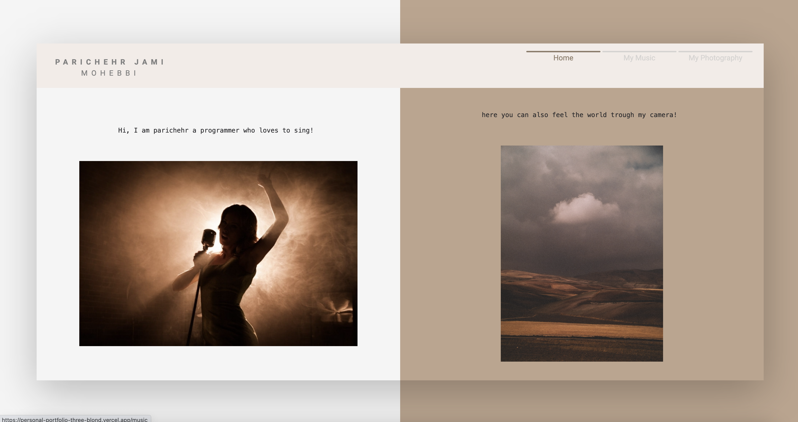

## About this repository

- This is my personal portfolio implemented using: Next.JS, Typescript, Tailwind CSS, SWR
- You can find nothing about my developer personality there, maybe its obvious as the creator of the protfolio, but you can find me as a singer and as a photographer there 😉

## How to get it work

- run 'npm install' command to install all the dependencies
- run 'npm run dev' or 'yarn dev' to start the development environment on 'localhost:3000'

## More to know

- Typescript is configured in tsconfig.ts file
- TailwindCSS is configured in tailwind.config.js

## References

- <a href='https://nextjs.org/docs' target='_blank'> Next.JS documentation </a>
- <a href='https://nextjs.org/docs' target='_blank'> TypeScript documentation </a>
- <a href='https://tailwindcss.com/'>Tailwind CSS documentation</a>
- <a href='https://swr.vercel.app/'>SWR documentation</a>
- <a href='https://gwfh.mranftl.com/fonts'>Google WebFonts Helper</a>
- <a href='https://sass-lang.com/documentation/'> Sass documentation</a>
